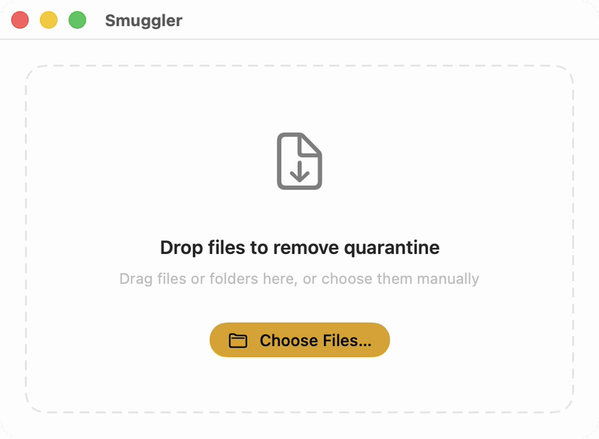
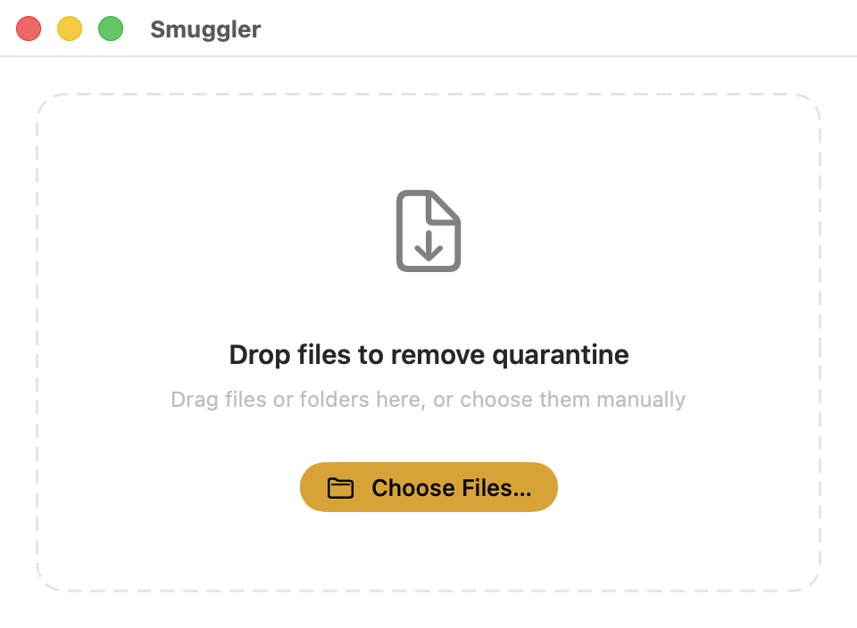
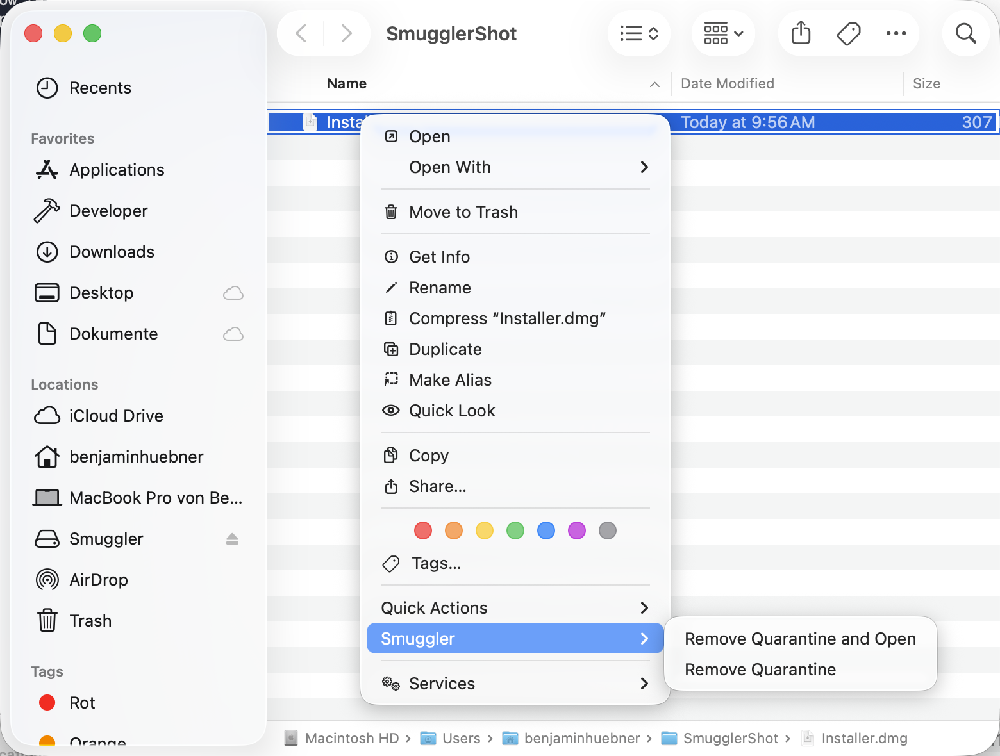

# Smuggler

**Free your downloaded files from macOS quarantine — without ever touching the Terminal.**

[](LICENSE) [](#requirements) [](#requirements)

*Drag a file in, right-click it in Finder, or pick it from a dialog — Smuggler removes the "downloaded from the internet" flag so your file just opens. No `xattr`, no jargon, no scary warnings.*

<a href="Docs/demo.gif"></a>

---

## Contents

- [About](#about)
- [Who it's for](#who-its-for)
- [Features](#features)
- [How it works](#how-it-works)
- [What it never does](#what-it-never-does)
- [Requirements](#requirements)
- [Built with](#built-with)
- [License](#license)

---

## About

When you download a file, macOS tags it with a hidden `com.apple.quarantine`
attribute. That tag is what triggers the *"…is an app downloaded from the
Internet, are you sure you want to open it?"* prompts — and sometimes the harder
*"cannot be opened because the developer cannot be verified"* wall.

The usual fix is an obscure Terminal command nobody should have to memorize:

```sh
xattr -d com.apple.quarantine /path/to/your/file
```

Smuggler replaces that with a single, friendly action. The interface stays
plain-spoken and reassuring: no "extended attributes", no "bypass macOS
security" framing — just a clear *"this is ready to open now."*

## Who it's for

Everyday Mac users who don't live in the Terminal and just want a downloaded
file, app, or folder to open without a fight. If you've ever pasted an `xattr`
command from a forum post and hoped for the best, Smuggler is for you.

## Features

<table>
  <tr>
    <td width="50%" valign="top">
      <a href="Docs/screenshots/drop.png"></a>
      <p><strong>Drag, drop, done</strong><br>Drop files or folders onto the window — or pick them with <kbd>⌘O</kbd> — and Smuggler frees each one. No command to remember.</p>
    </td>
    <td width="50%" valign="top">
      <a href="Docs/screenshots/finder.png"></a>
      <p><strong>Right in Finder</strong><br>Right-click any file and choose <em>Remove Quarantine</em> or <em>Remove Quarantine and Open</em> — the items appear only when the selection is actually quarantined.</p>
    </td>
  </tr>
</table>

- **Folders, recursively** — point Smuggler at a folder and it clears every file
  inside it, not just the folder itself.
- **Batch at once** — select as many files and folders as you like; each is
  processed independently and can be cancelled mid-flight.
- **Quiet when invoked from Finder** — headless actions report their result with
  a native notification, then get out of your way.
- **Open with confidence** — *Remove Quarantine and Open* always asks for a final
  human confirmation before launching anything.
- **Stays current** — built-in auto-updates via Sparkle.

## How it works

Smuggler removes exactly one piece of metadata — the `com.apple.quarantine`
extended attribute — and nothing else. Your files are never moved, copied,
renamed, opened, or altered in any other way. Removing the flag is the same
operation Gatekeeper would perform the first time *you* approve a file; Smuggler
just lets you do it deliberately, up front, on the files you choose.

## Requirements

- **macOS 26** or later.

Smuggler is distributed directly (not via the Mac App Store) and is signed with a
Developer ID and notarized by Apple.

## Built with


- [Sparkle](https://github.com/sparkle-project/Sparkle) (In-app software updates)


## License

[MIT](LICENSE) © 2026 Benjamin Hübner
